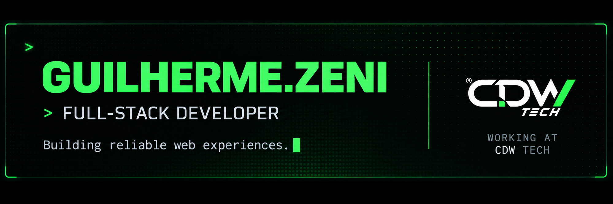
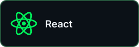
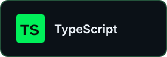
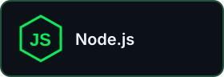
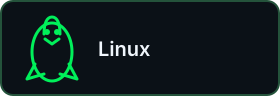

  

    

  

 

  <strong>⬡ &nbsp; TECH STACK</strong>
  &nbsp;&nbsp;━━━━━━━━━━━━━━━━━━━━━━━━━━━━━━━━&nbsp;&nbsp;
  <code>TOOLS FOR A BETTER WEB</code>

    

  
  
  
  
  
  

    

  
  
  

    

  

 

